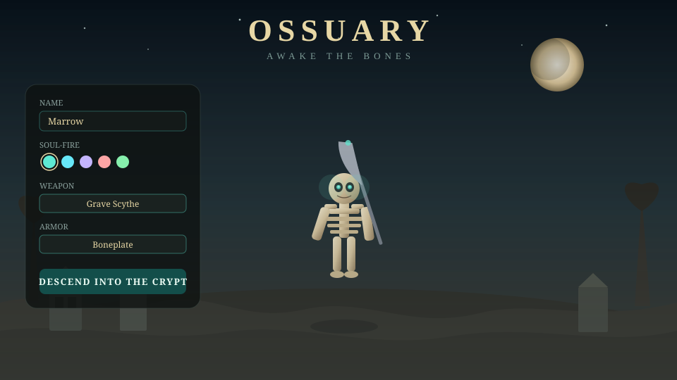

# Ossuary

Third-person graveyard demo starring a fully-rigged undead skeleton warrior.

Customize soul-fire, weapon, and armor, then hunt wights under a moonlit crypt.

## Play

**[Play Ossuary](https://antonybstack.github.io/ossuary/)**

Live URL: https://antonybstack.github.io/ossuary/

## Screenshots

Title screen — name your undead, pick soul-fire, weapon, and armor:



Grave scythe + Boneplate loadout before descending into the crypt:


## Controls

- **WASD** move · hold **right mouse** to look · **Shift** run
- **Space** or click to attack · **Tab** cycle targets
- **1** Bone Slash · **2** Soul Drain · **3** Raise Dead

## Run locally

```bash
npm install
npm run dev
```

Requires Node 22. Open the URL Vite prints (default `http://localhost:8080`).

## Stack

React 19, TanStack Start, Three.js, Tailwind CSS v4.
